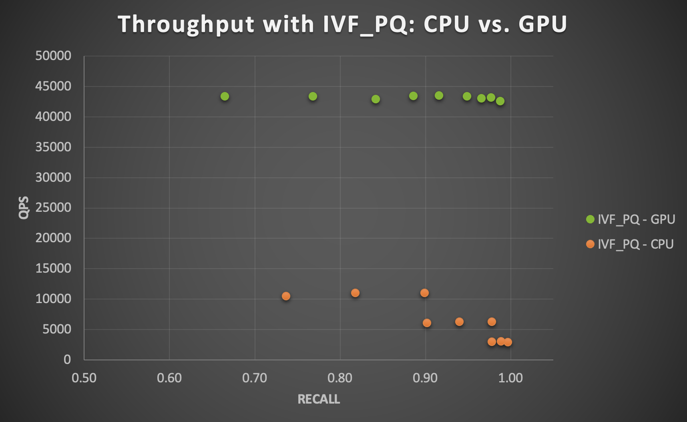

# Detailed Benchmark Results

To demonstrate the case for using a fast and efficient vector indexing/search library such as Milvus, and reporting on its performance, we have designed two sets of benchmarks.

- Using Milvus to build vector indexes with the two sets of embeddings we generated with Merlin: 1) user embeddings for 7.3M unique users, split as 85% train set (for indexing) and 15% test set (for querying), and 2) item embeddings for 49K products (with a 50-50 train-test split). This benchmark is done independently for each vector dataset and results are reported separately.
- Using Milvus to build a vector index for the 49K item embeddings dataset, and querying the 7.3M unique users against this index to retrieve most similar/relevant top k items.

Here is a summary over all parameter configurations tested with HNSW and IVF_PQ on CPU and GPU:

Dataset (YooChoose) | GPU Speedup | Recall | QPS
--- | --- | --- | --- 
Item-item similarity | 4x to 14x | 0.631-0.997 | Up to 42425 (with GPU)
User-user similarity | 3x to 11x | 0.904-0.999 | Up to 28185 (with GPU)
User-item similarity | 4x to 16x | 0.974-1.000 | Up to 42105 (with GPU)

We considered the following settings and variations of parameters in these benchmarks:
- Vector dataset: item embeddings (49K), user embeddings (7.3M)
- Top-k (k most similar items): 100
- Index type: HNSW, IVFPQ
- Insert parameters:
  + batch: 100
- Index hyperparameters:
  + HNSW:
    - m: 4, 8, 12, 16, 24, 36, 48, 64
    - efConstruction: 500
  + IVFPQ:
    - nList: 100, 200, 400
    - m: 64   (where embedding size Mod m = 0) 
    - nbits: 12
- Query hyperparameters:
  + HNSW:
    - nq: 1000
    - ef: 10, 20, 40, 80, 120, 200, 400, 600, 800
  + IVFPQ:
    - nq: 1000
    - nprobe: 5, 10, 20
- CPU vs. GPU
  + CPU: IntelⓇ Epyc 7642 / 2.3 Ghz with 2x48 CPU cores and 1 TB memory
  + GPU: NVIDIA A100 single GPU with 80 GB memory

Overall, we report recall vs. QPS (queries per second) tradeoff as well as well CPU times and GPU speedup factors.

Note: the query batch size (nq) we have used in our benchmarks. This is useful in workflows where multiple simultaneous requests can be sent to the inference server
(eg. offline recommendations requested and sent to a list of email recipients, or online recommendations created by pooling concurrent requests arriving in a short period of time
and processing them all at once). Depending on the use-case, Triton Inference Server can also help process these requests in batches.

<h2>Items vs. Items vector similarity search</h2>

Recall range with HNSW: 0.958-1.0

Recall range with IVF_PQ: 0.631-0.997

Total time in seconds to execute all queries on CPU, given a parameter combination:
  - HNSW: 5.22-5.33
  - IVF_PQ: 13.67-14.67

GPU speedup with IVF_PQ: 4x to 14x

See below for the detailed GPU-CPU speedup chart for all parameter combinations tested:

<h2>Users vs. Users vector similarity search</h2>

Recall range with HNSW: 0.884-1.0

Recall range with IVF_PQ: 0.904-0.999

Total time in seconds to execute all queries on CPU, given a parameter combination:
  - HNSW: 279.89-295.56
  - IVF_PQ: 3082.67-10932.33

GPU speedup with IVF_PQ: 3x to 11x

See below for the detailed GPU-CPU speedup chart for all parameter combinations tested:

